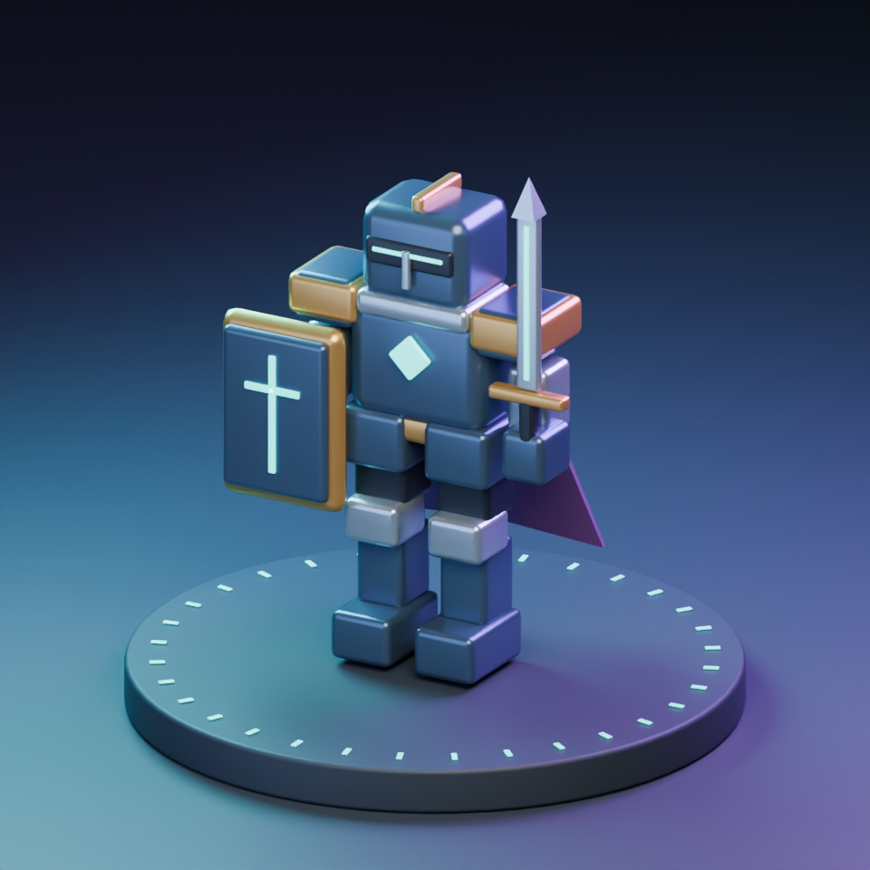

# Architecture and Blender as an asset workshop

> Historical proposal for the v2 prototype. Future development follows the [second overhaul plan](overhaul-v3/README.md), which replaces sprite-atlas presentation with skinned 3D models to meet the user's revised art requirements.

[Overhaul proposal](OVERHAUL.md) · [Current-game review](REVIEW.md)

## Recommendation

Use **TypeScript + Vite + Phaser for the browser game, with Blender producing models, animations, and rendered sprite atlases**. Keep combat decisions on a 2D plane and use a fixed, slightly elevated camera aesthetic. This recommendation is an engineering judgment for this project: it preserves the browser audience while supporting a much richer fortress, characters, and animation.

The 7,222-line HTML document currently mixes game state, random wave generation, damage calculations, save handling, canvas drawing, audio, and hundreds of lines of shop decoration. Splitting it into files is the first step. The bigger improvement is assigning each rule one owner so a weapon upgrade cannot silently alter a turret or bypass a charge calculation.

Phaser provides scenes that can separate boot, combat, and overlays, with scene lifecycle control and dedicated input/rendering facilities. It is a 2D framework; dimensional art would come from the asset pipeline. [Phaser scene documentation](https://docs.phaser.io/phaser/concepts/scenes), [Phaser documentation](https://docs.phaser.io/)

## Routes considered

| Route | Strengths for this game | Cost or limitation | Decision |
|---|---|---|---|
| TypeScript modules + current Canvas 2D renderer | Fast first migration; retains current behavior and deployment simplicity | We continue maintaining most animation, batching, asset, and camera machinery | Use as a short migration stage |
| Phaser + Blender-rendered sprites | Good fit for 2D combat; reusable animation clips; consistent lighting; manageable asset pipeline | Directional atlases consume texture memory; arbitrary camera rotation is impractical | Recommended production direction |
| PixiJS + custom simulation | Strong presentation control and a smaller opinionated game layer | More gameplay lifecycle, collision, and tooling decisions remain ours | Sensible if preserving a custom renderer is a priority |
| Three.js + Blender GLB assets | Real depth, freely rotated models, skeletal animation, dynamic lighting | Additional work for selection, occlusion, shadows, crowd rendering, UI, and performance | Choose if 3D camera/depth becomes a core creative requirement |
| Godot with a web export | Integrated editor, scenes, animation, and native build options | Larger workflow change and a separate web-export compatibility investigation | Revisit if native releases become an explicit objective |

Do not combine Phaser and Three.js merely to avoid choosing. A hybrid can add rendering and interaction coordination work before it adds player value. A 3D route can still run on GitHub Pages when all runtime assets are static files; it does not inherently require an application server.

Three.js supplies glTF loading and animation playback if that direction wins a prototype comparison. [GLTFLoader](https://threejs.org/docs/pages/GLTFLoader.html), [AnimationMixer](https://threejs.org/docs/pages/AnimationMixer.html)

## Proposed code ownership

```text
index.html                      minimal boot document
src/
  main.ts                       application setup
  game/
    scenes/                     Boot, Menu, Battle, Results
    simulation/
      RunState.ts               one fresh-state constructor
      CombatSystem.ts           damage, shields, death, attribution
      ProjectileSystem.ts       movement and collision
      StatusSystem.ts           burn, poison, stagger, expiry
      WaveDirector.ts           seeded encounter schedules
      EconomySystem.ts          bounties, purchases, repairs
      SquadSystem.ts            orders, targeting, capacity
    data/
      weapons.ts                typed, validated definitions
      upgrades.ts
      enemies.ts
      encounters.ts
    presentation/
      EntityViews.ts            sprites and animation state
      CombatEffects.ts          finite visual effects
      AudioDirector.ts
      CameraController.ts
    input/                      mouse, keyboard, touch, remapping
    persistence/                profile and run migrations
  ui/                           semantic shop/settings DOM and CSS
assets-src/
  blender/                      editable source scenes and rigs
  audio/                        source sessions and license notes
public/assets/                  exported runtime assets only
tools/blender/                  repeatable build/render/export scripts
tests/                          focused simulation and browser checks
```

Use ordinary typed modules and clear systems first. A full entity-component framework is not a prerequisite. Decide whether collision remains in our simple 2D simulation or uses an engine system during the prototype; never integrate the same body's motion in both. Phaser's Arcade Physics supports circles and rectangles, which cover many of the present game's needs. [Phaser physics documentation](https://docs.phaser.io/phaser/concepts/physics)

## Contracts that prevent the current problems

**Attack creation receives its owner.** Resolve a player weapon, turret weapon, or squad attack from that source's definition. Time slow changes clock rates; it does not replace every attack factory with a sniper factory.

**Damage follows one path.** An attack creates a damage event with an attack ID, owner, team, weapon ID, target, amount, and permitted effect tags. The combat system resolves shields, health, stagger, status application, and death once. The economy system awards a bounty once for an eligible hostile death. Summons, boss sacrifices, conversions, and despawns have explicit reward policies.

**Effects have bounded triggers.** Secondary lightning can consume a chain budget and avoid previously hit targets. It cannot recursively spawn another full primary attack unless an explicitly capped evolution says so. Damage-over-time and beam hits use documented tick rates and proc coefficients.

**UI describes resolved values.** Upgrade cards and damage tools read the same definitions. Show `0.36s → 0.32s`, damage, affected sources, rank cap, and prerequisites. Avoid separately maintained claims about percentages.

**Simulation owns timers.** One update loop advances fixed simulation steps, with a bounded catch-up budget. Seed gameplay randomness separately from decorative randomness. Rendering observes state; it does not remove projectiles, award kills, or decrement gameplay lifetimes. Pause suspends simulation timers and prevents delayed events from a previous run leaking into a restart.

**Save files distinguish purpose.** Settings contain bindings and accessibility choices. Profile data contains discoveries and cosmetic unlocks. A run snapshot contains its seed, phase, wave, build, gold, health, and required cooldowns. Save at stable boundaries first, then add mid-wave resume only if it is worth its complexity. Preserve legacy high scores separately if a major rules change makes scores incomparable.

## What “puppeting Blender” means in practice

I can write Python scripts executed by Blender to create geometry, assign materials, pose object hierarchies or armatures, keyframe animation, set cameras and lighting, render images, and export assets. Scripts and their parameters live in the repository so an asset can be regenerated consistently.

The local machine already has **Blender 4.3.2**. Background Python execution was verified. No Blender MCP server is required for this workflow. An interactive MCP bridge could be added later if inspecting and changing a live editor session would save meaningful time; the tested headless path already covers repeatable asset generation.

The asset production sequence should be:

1. **Design a silhouette:** one knight, one enemy, one turret. Judge all three at gameplay size before adding surface detail.
2. **Build modular geometry:** share bodies, helmets, weapons, shields, and cape mounts across variants.
3. **Create a production rig:** a small armature, reusable action clips, and consistent feet, grip, and projectile-emission sockets.
4. **Animate deliberate actions:** idle, locomotion, anticipation, strike, recovery, stagger, block, and death.
5. **Render a fixed camera:** initially eight directions, shared lighting and scale. Render alpha and separate shadows where helpful; generate atlas frame metadata and pivots.
6. **Pack and inspect:** trim carefully, retain consistent logical pivots, add atlas gutters, and inspect silhouettes against the actual battlefield.
7. **Import clips and event markers:** gameplay determines hit timing; visible animation follows that timing. Decorative playback should not silently alter attack rate.

For a real-time 3D route, export GLB and load its animation clips instead. Blender's exporter supports meshes, materials, and transform/bone/shape-key animation; arbitrary Blender shader graphs and simulated behavior do not all transfer. Bake or recreate unsupported effects deliberately. [Blender glTF documentation for the installed series](https://docs.blender.org/manual/en/4.3/addons/import_export/scene_gltf2.html)

## A working proof is included



`tools/blender/knight_puppet.py` creates this original modular Aegis Knight with a shield, sword, emissive inlays, and a 24-frame anticipation/strike/recovery action. It outputs:

- [Editable Blender scene](assets/knight-puppet/aegis-knight.blend)
- [Animated character GLB](assets/knight-puppet/aegis-knight.glb)
- [Rendered preview](assets/knight-puppet/aegis-knight-preview.png)

This is a technical and silhouette blockout using an animated object pivot. It is not a finished skinned character, a complete animation set, or a production sprite atlas. The GLB was inspected and contains 36 meshes and one animation with one channel; its size is 58,680 bytes. The scene rendered successfully in the installed Blender version. Browser performance of this asset has not been benchmarked.

Regenerate it from the repository root:

```powershell
& 'C:\Program Files\Blender Foundation\Blender 4.3\blender.exe' `
  --background --factory-startup --python-exit-code 1 `
  --python tools/blender/knight_puppet.py
```

The script creates a new background scene and writes the named proof outputs. Rerunning it replaces those generated outputs. Editable authored production assets should be kept separately from regeneration targets.

## Migration without losing the baseline

1. Preserve the deployed commit and reconcile the existing local draft deliberately. Record which balance edits are intended before moving code.
2. Extract CSS, data, simulation, and rendering into modules while retaining the current renderer. Resolve the confirmed lifecycle and upgrade-contract defects with focused tests.
3. Build one Phaser battle scene that reads the extracted definitions. Implement one complete weapon and three enemy roles.
4. Compare a sprite-based Blender knight with a GLB prototype at the intended battle density. Evaluate readability, asset size, frame time, production effort, and camera value. Confirm the final renderer here.
5. Complete the first five waves and one boss with the proposed shop and input scheme. This is the first playable overhaul milestone.
6. Expand content only after this loop earns repeated playtests. Migrate saves and then prepare deployment.

## GitHub Pages remains suitable

Vite produces a static `dist` directory. For this repository's Pages path, configure `base: '/NeonKnights/'` and deploy the build output through GitHub Actions. The existing root-branch publishing configuration would need to change when the build pipeline is introduced. Test the production output under that subpath so assets do not accidentally resolve from `/`. [Vite's GitHub Pages deployment guide](https://vite.dev/guide/static-deploy.html#github-pages)

A future online leaderboard would be a separate service decision. An offline game, settings, unlocks, and a reproducible challenge seed can all work without it. Keep large `.blend` sources and unnecessary intermediate frames out of the published artifact.

## Tools prepared in this review

Installed the official `playwright` and `screenshot` skills from `openai/skills` and the `@playwright/cli` browser automation tool. The skills are available on the next turn. Playwright was used to inspect the live game and produce browser evidence. Blender's existing installation was used for the asset proof.

The current toolchain is sufficient for the proposed next prototype. Additional servers, cloud rendering, and commercial asset tooling should be introduced for a demonstrated need, with their effect on iteration time and asset quality evaluated directly.
