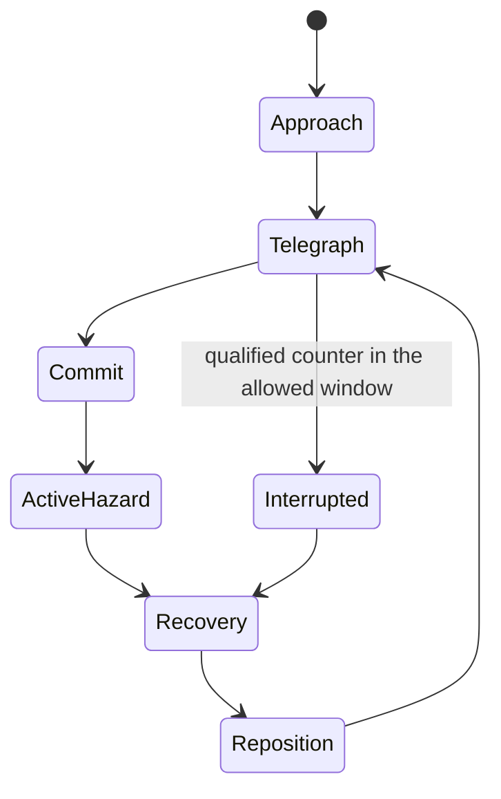

# Neon Knights: command a living fortress

Current direction: [King on the battlements, automatic company, three wall tiers](CASTLE_DIRECTION.md). This supersedes the earlier ground-roaming commander loop where they conflict.

The player is a commander fighting beside a company they have recruited and equipped. The fortress is a changing battlefield and a visible record of their decisions. Attacks have physical consequences; expensive purchases transform something the player can point to.

The existing siege-on-a-basalt-island identity remains valuable. The overhead view, dark stone, restrained neon, short browser launch and time control also remain. The four-anchor movement, temporary knight summons, generic structure shapes and single mixed three-card shop are replaced.

The user's paladin reference is the minimum asset standard. All sizes, costs, durations and content counts below are initial design targets for testing, not validated balance promises.

## 1. The commander is physically in the battle

Use continuous movement across the courtyard, connected battlements, ramps and accessible outer approaches. Movement and aim are independent. The player turns smoothly through 360 degrees, with locomotion and upper-body aim blended on a real skeleton.

The initial camera is a fixed elevated 3D view with restrained tracking and a tactical overview. Roofs and nearby foreground walls fade when they obscure the commander or an important threat. The overview must show threatened walls and off-screen siege preparation; camera movement must not make the fortress disappear from the player's awareness.

The commander has health and two recoverable dodge charges. Enemy melee swings, missiles, dives and boss hazards can hit them. Being downed costs time and a visible fortress rescue charge; it is not an extra unlimited resource. Start with one rescue per act. A rescued commander returns near the keep after a short delay while the garrison continues defending. The fortress remains the run's central failure condition.

| Default input                   | Action                                                               |
| ------------------------------- | -------------------------------------------------------------------- |
| WASD                            | Move across walkable ground and connected battlements                |
| Mouse / aim control             | Aim independently of movement                                        |
| Left mouse                      | Equipped weapon primary                                              |
| Right mouse                     | Weapon-specific alternate                                            |
| Space                           | Dodge; clearly displayed recoverable charges                         |
| Shift                           | Time slow, using visible focus energy                                |
| Q                               | Swap between two equipped weapons                                    |
| 1 / 2 / 3                       | Select a knight group                                                |
| Tab held                        | Tactical orders overlay; slows the world using the same focus budget |
| Left mouse while issuing orders | Move, hold, focus, protect or retreat at the selected target         |
| E                               | Context interaction: gates, objectives and downed allies             |
| Escape                          | Pause                                                                |

The tactical overlay must not grant unlimited free time. Releasing it restores ordinary aiming and clears its input state. Tactical orders also need explicit touch and keyboard buttons; a controller layout can follow the first playable keyboard/touch slice.

## 2. The arena changes what the player does

Keep the recognizable island but replace four compulsory lanes with several authored approach regions. Enemy formations use paths through causeways, ruins and breaches. They never materialize directly on a player or an uncovered camera edge.

An approach has a scout tell, a staging area and a navigable route. A wave can combine pressure on the outer wall with a skirmish near a supply wagon or a sapper climbing a side ramp. Choices create risk: opening a gate allows a counterattack and a shorter knight retreat route, but exposes the courtyard.

Start with a connected inner loop, two outer fighting areas, a gate, one ramp and one controllable choke. Add more topology after navigation and camera readability work. Physical height is represented by authored ground surfaces and ramp links. This keeps movement deterministic without simulating an entire rigid-body castle.

Examples of changes during a siege:

- A ram breaches a wall panel, creating a traversable opening and a new defensive problem.
- The Dragon leaves scorched ground that denies a convenient route for several seconds.
- A captured beacon reveals the next flanking force early; losing it removes that information.
- A supply cart arrives at an exposed location. Sending knights to escort it temporarily weakens the main defense.
- Engineers can restore a damaged choke during a planning break; its visual state changes with the repair.

Arena interaction should be legible and bounded. Begin with these authored states. General-purpose destruction, unrestricted building placement and a rotating camera would complicate the same problems without first proving the combat.

## 3. Attacks must exist in the world

Every significant hostile ability follows an explicit sequence:

The hazard is a simulation object with an owner, shape, position, lifetime, damage policy and animation/VFX cue. The rendered danger area and the collision query use the same geometry. A committed breath sweeps across space. A boulder travels from a hand to a landing point. Fire on the ground persists and damages units entering it. The fortress is damaged by contact with the attack, with a visible affected wall or structure.

Damage events must identify commander, knight, building, wall or enemy targets. Threat text is supplementary. With every message hidden, a player must still understand preparation, impact, damage, interruption and recovery.

Interrupts become authored opportunities. Armor protects a charging boss until a weak point opens. After a successful break, a visible resolve state temporarily prevents another stagger. An attack that has already committed resolves unless that specific ability permits a counter. Ordinary high DPS must not accidentally cancel every pattern.

### Prism Dragon: a moving first boss

The Dragon circles outside the playable area, casts a moving shadow, roars and lands on a visible approach. The chosen approach can vary among authored valid locations, with camera framing and warning time preserved. Its legs, neck, jaws, wings and tail use a dedicated skeleton.

| Pattern         | Visible preparation                                                                        | Physical outcome                                                                                 | Player response                                                                          |
| --------------- | ------------------------------------------------------------------------------------------ | ------------------------------------------------------------------------------------------------ | ---------------------------------------------------------------------------------------- |
| Sweeping breath | Plants its feet, inhales, chest and throat brighten; a bounded wedge shows sweep direction | The neck turns through a flame cone; contacted units are damaged; scorched ground lasts about 5s | Move through the safe side, retreat a group, or break the chest during its brief opening |
| Talon landing   | A flight pass and shadow converge on a landing area                                        | The Dragon lands, damages/staggers units in the marked circle and changes its attack position    | Dodge out; hold the garrison away from the landing area                                  |
| Tail sweep      | Hips turn and the tail draws back; a crescent is marked behind the body                    | A swept collision volume knocks back close attackers                                             | Move to the shoulder; brace a Warden formation                                           |
| Wall rake       | The Dragon chooses a nearby wall, grips it and exposes a wing joint                        | Repeated visible contact damages that wall and its mounted structure                             | Attack the wing or commit a knight counterattack                                         |

At half health, a broken plate exposes a stronger damage opportunity while the flight/landing sequence changes position. Destroying a wing node shortens its next flight and changes the upcoming pattern. A death animation settles the body and awards its relic cache after the combat resolves.

The first proof must show every pattern resolving against a stationary player and then being answered by an appropriate action. Constant interruption and invulnerability are separate test modes, not normal acceptance footage.

### Procession Golem

The Golem enters along a path while carriers attach pieces to its frame. It walks between valid attack locations. One arm throws a visible boulder; the other slams the ground into an expanding shockwave. Destroying an arm changes the model, removes the corresponding ability and alters its next choices. Gathering carriers exposes a core and creates a real contest for the garrison.

Carriers use formation and navigation rules, not simultaneous pulls toward the Golem and castle. Absorption transfers a bounded amount of armor or limb health. Sacrificed and summoned units have no renewable economic reward. The Golem's attack reach and rebuilt geometry agree.

### Hollow King

The King moves between command positions, plants banners, fights at close range when approached and sends authored decree formations. Destroying the active banner or overcoming its formation creates a crown opening. His sweeping blade, dark shield and lance attacks are physical volumes with different counters. Final-phase pressure comes from a visible combination of familiar rules; hidden perfect counters to the player's build are excluded.

## 4. Build from a catalogue and watch the fortress change

Construction has its own planning section and an always-visible catalogue. All core building families can be inspected from the start. Known tier upgrades remain purchasable when their prerequisites and cost are met. Random rewards may unlock a special blueprint, but a routine Ballista upgrade must never depend on drawing its card.

Start from ten potential sockets: six wall platforms and four courtyard sites. Some structures require a suitable site. Core capacity initially supports about four ordinary buildings, then rises after act milestones toward a fully developed fortress. This separates placement choice from the old four-sector shop restriction while retaining readable constraints. Capacity and footprint costs are shown before purchasing.

Selecting a building opens a large model view, three-tier comparison, upgrade branches, targeting arc and an on-arena placement ghost. The player chooses its orientation where that changes coverage. In planning, relocation is free; salvage returns a stated portion of investment without a once-per-act lock. Construction is an assembling-parts animation with a visible crew and a working mechanism at completion.

| Family              | Tier I                                           | Tier II                                                    | Tier III / specialization                                              | Legendary possibility                                                                   |
| ------------------- | ------------------------------------------------ | ---------------------------------------------------------- | ---------------------------------------------------------------------- | --------------------------------------------------------------------------------------- |
| Royal Ballista      | Timber carriage, working bow arms and winch      | Armored turntable, larger limbs and a visible loading rack | Siege frame with bracing legs; choose pinning or piercing bolts        | **Worldpiercer:** recoil anchors deploy for a large bolt that breaks a siege formation  |
| Storm Pylon         | A grounded coil and charged insulators           | Paired conductors and a rotating charge cage               | A bridged conductor array; choose area control or focused discharge    | **Tempest Cathedral:** visibly connects to adjacent defenses and changes pulse behavior |
| Aegis Projector     | A directional shield emitter                     | Hinged protection plates and a larger focus                | A multi-panel shield engine; choose protection arc or reflected return | **Dawn Engine:** stores bounded blocked energy and releases a directed counterblast     |
| Chapel              | A small shrine with a working bell and attendant | Lit cloister, reliquary and treatment station              | A sanctuary with distinct healing or rally equipment                   | **Choir of the Returned:** rescues a downed knight through a visible, limited ritual    |
| Ossuary             | Bone brazier and soul vessel                     | Ribbed collection machinery and a larger vessel            | A crypt engine for controlled spectral recruits                        | **Graveglass Court:** stored echoes become an identifiable temporary support force      |
| Barracks / workshop | Bunks, racks and an active forge                 | Training court and repair gantry                           | A command hall with a specialist company upgrade                       | **The King's Muster:** changes group formation and equipment support                    |

Treasury, moat and further structures follow the same asset/behavior contract after the first families prove satisfying. All regular tiers require modeled differences in silhouette, machinery and material treatment. A scale increase, glow change or Roman numeral is insufficient.

## 5. Knights are a company the player builds

Recruit named knights into a run-persistent roster. Start with three active knights, grow toward six active and two reserve places, and divide the active company into up to three groups. The initial classes are Warden, Lancer, Marksman and Chanter. A class defines its stance, weapons, behavior and useful job; an equipped item changes that job in a visible way.

Each knight has health, a role, a short trait, experience earned from service, a current order and three equipment slots: weapon, armor and insignia. Avoid large randomized affix stacks. A trait should create a readable tradeoff, such as holding position more reliably but repositioning more slowly.

| Class    | Autonomous role                                                | Deliberate order                                 | Visible equipment                                                         |
| -------- | -------------------------------------------------------------- | ------------------------------------------------ | ------------------------------------------------------------------------- |
| Warden   | Intercepts close threats within a leash distance               | Brace a line or protect a chosen ally            | Shield shape, sword/mace, plate armor and shoulder insignia               |
| Lancer   | Engages an isolated threat and disengages for another approach | Form and execute a charge along a selected path  | Spear length/head, armor, pennant; a mount is a substantial later upgrade |
| Marksman | Keeps a firing distance and avoids a blocked shot              | Focus an enabler or cover an approach            | Bow/crossbow, quiver and lighter armor                                    |
| Chanter  | Supports nearby allies and stays behind the front              | Channel a rally or rescue at a selected location | Staff, reliquary, robes and banner                                        |

Orders persist until changed or completed. A move/hold order assigns formation slots instead of a shared target point. Units maintain separation, choose reachable attack positions, respect friendly front lines and use target reservations. Ranged units should not try to stand inside their targets; melee units should not all chase one retreating enemy beyond their assigned area.

Living knights do not disappear on a timer. On defeat, a knight is downed, creating a short rescue opportunity; unresolved casualties become wounded and require treatment or a reserve substitution in planning. Equipment stays with the company. Permanent campaign loss of a named knight is an optional later difficulty rule, not the default punishment in a short browser run.

Equipment may be reassigned freely during planning. Weapons and major armor pieces appear on the model. A portrait panel shows the same model in a posed close-up, letting the player inspect the quality and build attachment. Rank promotions unlock a choice of behavior, rather than simply increasing the number spawned by Space.

Example: a Warden with a **Thunderhead Shield** stores one charge when blocking a hostile missile. On the player's next brace release it sends a short chain discharge. A Marksman carrying **Graveglass Fletching** instead marks one eligible fallen enemy for the Ossuary. Their equipment and job are both recognizable.

## 6. Separate the planning systems

Planning is one shared space with a persistent gold balance and four clearly distinct sections:

| Section      | Reliable choices                                                             | Variable discoveries                                               |
| ------------ | ---------------------------------------------------------------------------- | ------------------------------------------------------------------ |
| Construction | Place, rotate, upgrade, relocate, repair and salvage known structures        | Rare blueprints and legendary building conversions                 |
| Armory       | Inspect owned weapons, buy known improvements, equip two weapons, move runes | Six rune/item offers, at least two useful categories when eligible |
| Garrison     | Recruit, assign groups, equip knights, promote and treat injuries            | A changing recruit roster and specialized equipment                |
| Relics       | Inspect recipes, prerequisites, milestones and the collection                | Earned relic caches offering three materially different choices    |

The active weapon can be changed. A purchased weapon remains in the armory with its invested ranks. Run with two equipped weapons and up to three rune sockets per weapon; unselected equipment stays in storage. Rune removal and reassignment are free at planning breaks. The first act introduces only the initial sockets, while later milestones open the full loadout.

An owned rune remains an inventory item even when unequipped. Filling sockets must not remove every new rune from the market. Offers can explain an actual swap: “Replace Venom Seal with Conductive Brand: lose damage over time, gain chain setup for your Wardens.” Incompatible items are labelled before purchase, with the compatible owned gear shown.

The catalogue guarantees ordinary progress. The market supplies changing opportunities. Buying one item does not replace all other offers. Rerolls are explicit, priced, and scoped to their section. Selling and rebuying cannot regenerate stock, duplicate a relic or create gold.

Gold remains the main resource so constructing a defense competes honestly with outfitting a knight. Boss sigils are reserved for major transformations. Additional currencies require a demonstrated gameplay purpose.

### Legendary upgrades and presentation

A legendary changes a rule, has an authored visual identity and opens a build decision. It is not an ordinary rank with a larger percentage and a rainbow border.

| Legendary                  | New behavior                                                                                                           | Limit or tradeoff                                                           | Visual identity                                                                                         |
| -------------------------- | ---------------------------------------------------------------------------------------------------------------------- | --------------------------------------------------------------------------- | ------------------------------------------------------------------------------------------------------- |
| **Oath of the Storm King** | The commander designates an enemy; equipped knights relay one controlled lightning attack through the marked formation | Requires a prepared mark and a bounded relay; each target is struck once    | Engraved electrum plate, indigo enamel, a crown-and-fork motif; conductors appear on participating gear |
| **Worldpiercer**           | Converts a Ballista into an anchored formation-breaking siege weapon                                                   | Slower traversal/reload; firing line becomes a placement commitment         | Heavy bronze fittings, ivory mechanism and a long finned bolt; visible recoil and reset                 |
| **Choir of the Returned**  | A Chapel-led ritual can recover a downed company member during combat                                                  | Limited ritual charges; channel must survive                                | Pearlescent gold frame, carved wing motif and a physical lantern procession                             |
| **The Black Standard**     | A knight group gains strength while holding its ordered ground                                                         | The bonus ends on retreat, rewarding a deliberate line rather than chasing  | Violet-black enamel, silver relief and a torn banner mounted on the leader                              |
| **Prism Heart**            | A fully charged Sunlance shot can be redirected by a placed mirror                                                     | Uses a clear prepared surface and reduced secondary damage                  | Iridescent glass inset, geometric border; a mirror fixture appears in the battlefield                   |
| **Cinder Sovereign**       | Changes venting into a controlled fire front that supports a knight push                                               | Consumes stored heat and creates a temporary unsafe route for the commander | Ember glass, heat-blackened metal and a moving valve assembly                                           |

The plate hierarchy is fixed: rendered item/model art, name, rarity and affected system, a one-sentence transformation, exact resolved effects, costs/tradeoffs, compatibility, and an inspectable before/after. Chroma is local foil/iridescence on authored materials and borders. Cards remain still while read; reduced motion retains the same hierarchy and a non-color rarity symbol.

The first legendary choice arrives early enough to shape the run. Start by testing an earned choice near the first boss and another in act II. Stronger late discoveries must still be useful because equipment and building investment can be redirected.

## 7. The run should keep asking for decisions

Normal difficulty needs pressure from simultaneous jobs, imperfect protection and changing formations. Increasing enemy health cannot by itself repair a static encounter. Keep three acts as the campaign scaffold, but set lengths from observed play rather than filling fifteen identical spawn batches.

An encounter director spends an authored threat budget on staging, composition, flanking and tempo. Some enemies screen, some attack a structure, some threaten knights and some pursue the commander. Brief preparation, overlapping engagements and recovery periods create rhythm. The director may adjust when a remaining group enters to prevent long idle gaps, but it cannot secretly change enemy statistics in response to a strong build.

| Run stage      | Pressure                                                                    | Meaningful progression still available                                                          |
| -------------- | --------------------------------------------------------------------------- | ----------------------------------------------------------------------------------------------- |
| Opening        | Learn moving, aiming and one garrison order under a single clear threat     | First construction choice, a recruit/equipment decision, early rune pairing                     |
| Act I climax   | Dragon movement, committed hazards, a second threatened area                | First specialization and an earned legendary choice                                             |
| Act II         | Multiple enemy roles, structures taking damage, rescues and flanking routes | Tier-II/III machinery, promotions, weapon swap opportunities, stronger rune interactions        |
| Wave 11 onward | A developed fortress must answer siege mechanics and company attrition      | Additional legendary directions, final promotions, specialized defenses and viable build pivots |
| Finale         | Familiar mechanics combine under clear decrees                              | A completed build gets a meaningful final test                                                  |

Fortress durability has authored upgrade limits. Repairs restore missing health; they are not disguised unlimited maximum-health increases. Automatic defenses and an unattended company cannot reliably complete Normal. Excellent active play can still avoid large amounts of damage—there is no artificial damage tax to make the numbers look difficult.

Instrument each planning visit: affordable meaningful choices, duplicated filler, incompatible stock, unused gold, upgrades purchased, available pivots and new mechanics unlocked. Sample each act with weak, ordinary and strong builds. Flag a late shop with fewer than three relevant opportunities across available systems; do not solve the flag by filling it with trivial stat upgrades.

The original perfect-aim harness is a reachability test. New probes include delayed reaction, missed shots, imperfect targeting, no commands, standing still, different spending policies and deliberately incomplete builds. They bracket failure modes; human playthroughs decide whether Normal is engaging and whether decisions remain understandable.

## 8. A concrete minute in the new game

The commander leaves the western battlement to intercept a marksman near a broken cart. Their Warden group holds the gate while two equipped Marksmen cover a ramp. A scout horn announces a Dragon pass; its shadow crosses the courtyard before it lands near the eastern wall.

The player retreats the Marksmen from a breath wedge, dodges through the safe side and exposes the Dragon's chest with a charged Stormbow shot. This interruption creates one opening. The next attack commits through the Dragon's visible resolve, forcing the commander to move around the lingering fire while a Ballista physically winches and releases its shot.

After the encounter, the damaged Warden is still in the roster. The player treats them, replaces their insignia, upgrades the Ballista's carriage and selects a legendary that makes its slower, heavier shot support the company. The fortress, the knight and the next combat plan all visibly change.
